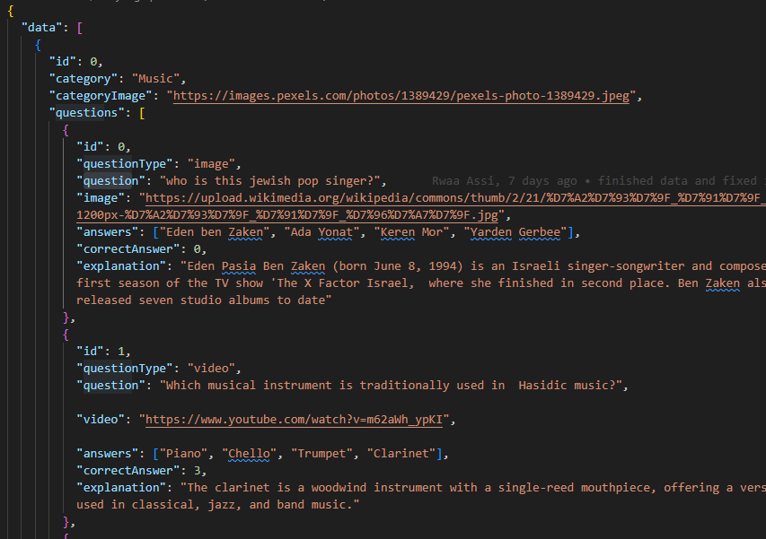

data1.ui

2.choosing category container and click on it ( from the home page)

3.u are directed to the Question page

---

4.depandeing on the question u will get displayed the question and the question type

\*we will get the category :id from the useParams

\*we have to find the category with the Id inside the data.json

- 

* depending on the question type we will render the question type component

  \*passing {questions} props-- questions and deconstruct the props-----דיסטראקשן

*
* 5.inside the question type you will have answer button and timer
  \*question.answers display that iterate

  6.we have 3 options :

* clilcking the correct answer button --->the answer button color will be change to green
* clilcking the not correct answer button --> the answer button color will be changes to red and in addition the right answer will be changed to green and also displayed
* not clicking at all any answer --> the right answer will be changed to green

  \*timmer - will be finished or interupted

  parallel

* Notification with the right color background + description + title will be displayed accordingly to the situation

  7.to display the next question wil will click on the Next Quetion button

* 8.when we arrive to the last question in the category clicking on the Next Question will direct us to the homepage back.
